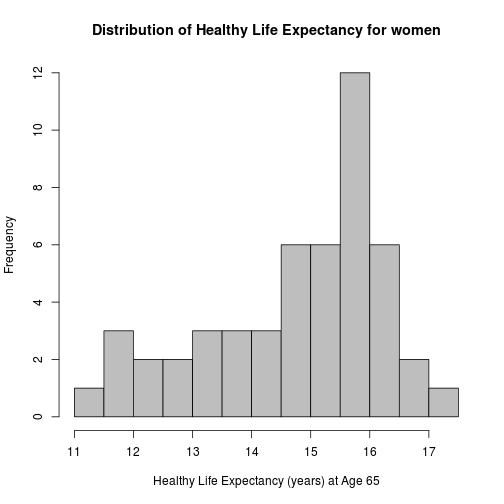
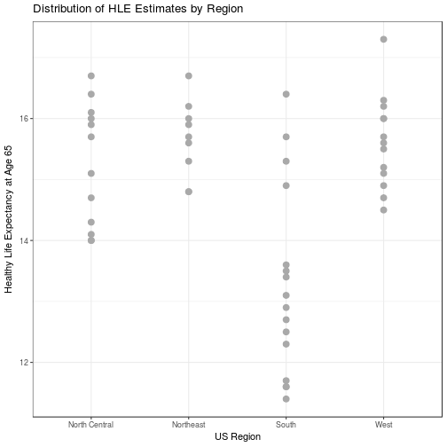
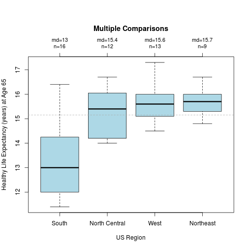

Github地址：<https://github.com/ShixiangWang/learn-devel-Rpkg>

内容源自《R实战》第二版，酌情删改。

## 写在阅读之前

如果你想要的是快速构建R包骨架，推荐阅读[在巨人的肩膀前行 催化R包开发](http://blog.fens.me/r-package-faster/)进行学习；如果你想了解更为基本的R包创建知识和过程，推荐阅读[开发自己的R包sayHello](http://blog.fens.me/r-build-package/)、谢益辉写的[编写R包](https://bookdown.org/yihui/r-ninja/r-package.html)章节以及本文[创建包的文档](#document-pkg)和[建立包](#build-pkg)章节。阅读一篇文档就想写好R包是远远不够的，还需要不断地实战和理解，才能融会贯通。不仅如此，一些函数和文档写法、技巧也是值得学习的，这正是本文的价值所在。

Let's begin!

<!-- more -->

<details>
<summary>Table of Contents</summary>

## Table of Contents

* [介绍](#intro)
* [非参分析和npar包](#npar-pkg)
* [开发包](#devel-pkg)
* [创建包的文档](#document-pkg)
* [建立包](#build-pkg)
* [深入学习](#further-reading)


</details>

## <a name="intro"></a>介绍

**技术上，包只不过是一套函数、文档和数据的合集，以一种标准的格式保存**。包让你能以一种定义良好的完整文档化方式来组织你的函数，而且便于你将程序分享给他人。

下面是几条我们可能想要创建包的理由：

- 让一套常用函数及其使用说明文档更加容易取用。
- 创造一个能解决重要分析问题（比如对缺失值的插值）的程序（一套相关函数）。

创造一个有用的包也是自我介绍和回馈R社区的好办法，R包可以直接分享或者通过CRAN和Github的在线软件库分享。

这里我们一起来学习如何从头到尾开发一个R包。我们将要开发的包名为`npar`，它提供非参组间比较的函数。如果结果变量是非正态或者异方差的，这套分析技术可以用来比较两组或多个组。这是分析师经常遇到的一个问题。

请使用以下代码下载包，然后保存到你现在的工作目录，接着把它安装到默认的R库当中。


```r
pkg <- "npar_1.0.tar.gz"
loc <- "http://www.statmethods.net/RiA"
url <- paste(loc, pkg, sep="/")
download.file(url, pkg)
install.packages(pkg, repos = NULL, type = "source")
```

```
## Installing package into '/home/wangshx/R/x86_64-pc-linux-gnu-library/3.4'
## (as 'lib' is unspecified)
```

在接下来的内容中，我们将把`npar`包当做一个测试的地方，描述和展示它的功能特性和函数。然后接着我们从头开始创建包。

## <a name="npar-pkg"></a>非参分析和npar包

**非参分析**是一种数据分析方法，它在传统参数分析的假设（比如正态性和同方差）不成立的情况下特别有用。这里我们会着重比较两组间或多组相互独立的数值结果变量的方法。

我们对`npar`包中的`life`数据集进行探究，它提供了对2007-2009年美国每个州65岁人的健康预期寿命（Healthy Life Expectancy, HLE）。估计值分别针对男性（`hlem`）和女性(`hlef`)。

数据集也提供了一个名为`region`（地区）的变量，此变量分为东北部、中北部、南部和西部。我从R标准安装中的`state.region`数据框中提取该变量并添加到所关注的数据集中。

假设我们想指导女性的HLE估计值是否在不同地区有显著的不同，一种方式是使用单因素方差分析，不过方差分析假设结果变量时正态分布的，并且不同地区之间的方差是同质的，让我们对这两个假设进行检查。

女性的HLE估值的分布可以用直方图来可视化。


```r
library(npar)
hist(life$hlef, xlab="Healthy Life Expectancy (years) at Age 65",
     main="Distribution of Healthy Life Expectancy for women",
     col="grey", breaks = 10)
```



上图可以看出因变量是负偏的，较低的值数量较少。

不同地区的HLE分数的方差可以用并排点图来可视化：


```r
library(ggplot2)
ggplot(data=life, aes(x=region, y=hlef)) + 
    geom_point(size=3, color="darkgrey") + 
    labs(title="Distribution of HLE Estimates by Region",
         x="US Region", y="Healthy Life Expectancy at Age 65") + 
    theme_bw()
```



上图中的每个点代表一个州，每个地区的方差都有所不同，东北部和南部的方差差异最大。

**因此此数据不符合方差分析的两个重要假设**，所以我们需要不同的分析方法。不像方差分析，非参方法不作出正态性和同方差的假设。在这个例子中，我们只需要假设数据是有序的——更高的分值意味着更高的HLE。因此，对于此问题，非参方法是一个合理的选择。

### npar包比较分组

我们可以使用`npar`包比较独立组别的数值型因变量，至少要求它是有序的。对于数值型因变量和分类型分组变量，它提供了一下几方面功能：

- 综合Kruskal-Wallis检验，检验组间是否有差异。
- 每一组的描述性统计量
- 事后比较（Wilcoxon秩和检验），即每次进行两组之间的比较，检验得到的p值可以调整，以进行多重比较。
- 都带有注释的并排箱线图，用于可视化不同组别之间的差异。

以下代码实现了用`npar`包对不同地区女性的HLE估值进行比较：


```R
library(npar)
results <- oneway(hlef ~ region, life)
summary(results)
```

```R
## data: hlef on region 
## 
## Omnibus Test
## Kruskal-Wallis chi-squared = 17.8749, df = 3, p-value = 0.0004668
## 
## Descriptive Statistics
##        South North Central   West Northeast
## n      16.00         12.00 13.000     9.000
## median 13.00         15.40 15.600    15.700
## mad     1.48          1.26  0.741     0.593
## 
## Multiple Comparisons (Wilcoxon Rank Sum Tests)
## Probability Adjustment = holm
##         Group.1       Group.2    W       p   
## 1         South North Central 28.0 0.00858 **
## 2         South          West 27.0 0.00474 **
## 3         South     Northeast 17.0 0.00858 **
## 4 North Central          West 63.5 1.00000   
## 5 North Central     Northeast 42.0 1.00000   
## 6          West     Northeast 54.5 1.00000   
## ---
## Signif. codes:  0 '***' 0.001 '**' 0.01 '*' 0.05 '.' 0.1 ' ' 1
```

```r
plot(results, col="lightblue", main="Multiple Comparisons",
     xlab="US Region", ylab="Healthy Life Expectancy (years) at Age 65")
```


首先，代码运行了一个Kruskal-Wallis检验，这是对不同地区间HLE差异的总体检验，p值0.0005指出确实存在差异。

接着，计算了每一个地区的描述性统计量，东北部HLE估值最高，南部最低；地区变化量最小的是东北部，最大的是南部。

尽管K-W检验表示不同地区的HLE有差异，但没有指出有多大的差异。若要得出此信息，需要用Wilcoxon秩和检验来成对地分组比较。对于四个组别，有4x(4-1)/2=6次比较。

南部和中北部的差异是统计上显著的（p=0.009），而东北部和中北部之间的差异并不显著（p=1.0），实际上，南部和其他地区都有所差异，但是其他地区之间的差异并不显著。

**在计算多重比较的时候，必须考虑到alpha膨胀的可能性**：实际上组别之间并没有显著差异，但是计算出存在差异的概率有所上升。对于六次独立的比较过程，至少有一次出错误差异的概率是$1-(1-0.05)^6$或$0.26$。

发现至少有一个错误的概率在四分之一左右，所以我们会想对每一次比较的p值进行调整，这样使得整体错误率保持在一个合理的水平（比如0.05）。

`oneway()`函数使用R标准安装的`p.adjust()`函数来完成这个功能。`p.adjust()`函数用很多种方法的其中一种来对多重比较的p值进行调整。尽管Bonferonni校正可能最广为人知，但是Holm校正更加强大，因此后者被设置为默认选项。

使用图形最容易看出不同组别之间的差异。`plot()`语句生成并排的箱线图。一条水平虚线表示所有观测值总体的中位数。

这些分析明显地指出南部女性很可能在65岁之后的预期寿命更短。这对健康服务的分布和侧重点也有所启示。你如果想分析一下男性的HLE估计值，看看是否会有类似的结论。

**下一节描述了`npar`包的代码文件**。

## <a name="devel-pkg"></a>开发包

`npar`包有四个函数：`oneway()`、`print.oneway()`、`summary.oneway()`和`plot.oneway()`。第一个是主函数，计算相关的统计量；另外三个是用于输出和画图的S3面向对象泛型函数。

一个不错的办法是把每个函数分布放在扩展名为.R的不同文本文件中。尽管这不是严格要求的，但是能够使你更好地组织工作。此外、尽管并不要求函数名和文件名相同，不过这是一个好的代码习惯。

点击下方函数名可阅读文件内容：

- [oneway](./npar/R/oneway.R)
- [print.oneway](./npar/R/print.R)
- [summary.oneway](./npar/R/summary.R)
- [plot.oneway](./npar/R/plot.R)


每个文件的开头都包含了一系列以`#'`开头的注释。R解释器会忽略它们，不过我们可以使用`roxygen2`包来把这些注释转换为我们的R包文档。

`oneway()`函数计算相关的统计量，`print()`、`summary()`和`plot()`展示结果。下面我们学习开发`oneway()`函数。

### 计算统计量

[oneway.R](./npar/R/oneway.R)文件中的`oneway()`函数计算所有所需的统计量。

**下面我们分段解析**。

```R
#' @title 非参组间比较
#'
#' @description
#' \code{oneway} 计算非参组间比较，包括综合检验和事后成对组间比较
#' 
#' @details
#' 这个函数计算了一个综合Kruskal-Wallis检验，用于检验组别是否相等，接着使用
#' Wilcoxon秩和检验来进行成对比较。如果因变量之间没有相互依赖的话，可以计算精确
#' 的Wilcoxon检验。使用\code{\link{p.adjust}}来对多重比较所得到的p值进行调整
#' 
#' @param formula 一个formula对象。用于表示因变量和分组变量之间的关系
#' @param data 一个包含了模型里变量的数据框
#' @param exact logical变量。如\code{TRUE}，计算精确的Wilcoxon检验
#' @param sort logical变量，如果\code{TRUE}，用因变量中位数来对组别进行排序
#' @param method 用于调整多重比较的p值的方法
#' @export
#' @return 一个有7个元素的列表
#' \item{CALL}{函数调用}
#' \item{data}{包含因变量和组间变量的数据框}
#' \item{sumstats}{包含每组的描述性统计量的数据框}
#' \item{kw}{K-W检验的结果}
#' \item{method}{用于调整p值的方法}
#' \item{wmc}{包含多重比较的数据框}
#' \item{vnames}{变量名} 
#' @author Rob Kabacoff <rkabacoff@@statmethods.net>
#' @examples
#' results <- oneway(hlef ~ region, life)
#' summary(results)
#' plot(results, col="lightblue", main="Multiple Comparisons",
#'      xlab="US Region", ylab="Healthy Life Expectancy at Age 65")
```

头部包含以`#'`开头的注释会被`roxygen2`包用于生成包文档。接下来你会看到列出的函数参数。用户提供一个形为**因变量~分组变量**的模型公式和一个包含了数据的数据框。默认会计算近似的p值并按照因变量中位数对组别排序。用户可以从八种调整p值的方法选择一种，其中`holm`方法（列出的第一个选项）为默认选项。

```R
oneway <- function(formula, data, exact=FALSE, sort=TRUE,               
                method=c("holm", "hochberg", "hommel", "bonferroni",      
                         "BH", "BY", "fdr", "none")){
  ######### 检查参数 ##########
  if (missing(formula) || class(formula) != "formula" ||
        length(all.vars(formula)) != 2)                                   
       stop("'formula' is missing or incorrect")  

  method <- match.arg(method) # 参数匹配
    
    
  ######## 设定数据 ###########
  df <- model.frame(formula, data)                           
  y <- df[[1]]
  g <- as.factor(df[[2]])
  vnames <- names(df)
  
  ######## 重新排序 ############
  if(sort) g <- reorder(g, y, FUN=median)                          
  groups <- levels(g)
  k <- nlevels(g)
  
  
  ######## 计算总体统计量 ########
  getstats <- function(x)(c(N = length(x), Median = median(x),      
                          MAD = mad(x)))   
  sumstats <- t(aggregate(y, by=list(g), FUN=getstats)[2])
  rownames(sumstats) <- c("n", "median", "mad")
  colnames(sumstats) <- groups
  
  ######## 统计检验 ###########
  kw <- kruskal.test(formula, data)                          
  wmc <- NULL
  for (i in 1:(k-1)){
    for (j in (i+1):k){
      y1 <- y[g==groups[i]]
      y2 <- y[g==groups[j]] 
      test <- wilcox.test(y1, y2, exact=exact)
      r <- data.frame(Group.1=groups[i], Group.2=groups[j], 
                      W=test$statistic[[1]], p=test$p.value)
      # note the [[]] to return a single number
      wmc <- rbind(wmc, r)
    }
  }
  wmc$p <- p.adjust(wmc$p, method=method)
  
  
  data <- data.frame(y, g)                                    
  names(data) <- vnames
  results <- list(CALL = match.call(), 
                  data=data,
                  sumstats=sumstats, kw=kw, 
                  method=method, wmc=wmc, vnames=vnames)
  class(results) <- c("oneway", "list")
  return(results)
}


```

结果被打包并作为一个列表返回。最后该列表的类被设置为`c("oneway", "list")`，**这是使用泛型函数处理对象的重要步骤**。

尽管列表提供了所有需要的信息，但你一般不会直接获取单个分量的信息。相反，你可以创建泛型函数`print()`、`summary()`和`plot()`以更加具体而有意义的方法来表达它们。

### 打印结果

各个领域的大部分分析函数都伴随着对应的泛型函数`print()`和`summary()`。`print()`提供了对象的基本或原始信息，`summary()`提供了更加具体或处理（汇总）过的信息。如果图形在上下文中是有意义的，`plot()`函数也经常一起提供。

**在S3面对对象中，如果一个对象有类属性"foo"，则`print(x)`在`print.foo()`函数存在时运行`print.foo()`，在`print.foo()`函数不存在时运行`print.default()`。`summary()`和`plot()`也有着相同的规则**。因为`oneway()`函数返回一个类为"oneway"的对象，所以你需要定义`print.oneway()`、`summary.oneway()`和`plot.oneway()`函数。

对于life数据集，`print(results)`生成了多重比较的基本信息：


```r
print(results)
```

```
## data: hlef by region 
## 
## Multiple Comparisons (Wilcoxon Rank Sum Tests)
## Probability Adjustment = holm
##         Group.1       Group.2    W       p
## 1         South North Central 28.0 0.00858
## 2         South          West 27.0 0.00474
## 3         South     Northeast 17.0 0.00858
## 4 North Central          West 63.5 1.00000
## 5 North Central     Northeast 42.0 1.00000
## 6          West     Northeast 54.5 1.00000
```

代码打印了一个有信息量的头部，接着是Wilcoxon统计量和调整后的每一对组别的p值（Group.1和Group.2）。

其源代码文件[`print.R`](./npar/R/print.R)内容如下：

```R
#' @title 打印多重比较的结果
#'
#' @description
#' \code{print.oneway} 打印多重组间比较的结果
#'
#' @details
#' 这个函数打印出用 \code{\link{oneway}} 函数所创建的Wilcoxon成对多重比较的结果 
#' 
#' @param x 一个 \code{oneway}类型的变量
#' @param ... 要传输给函数的额外的变量
#' @method print oneway
#' @export
#' @return 静默返回输入的变量
#' @author Rob Kabacoff <rkabacoff@@statmethods.net>
#' @examples
#' results <- oneway(hlef ~ region, life)
#' print(results)
print.oneway <- function(x, ...){
  if (!inherits(x, "oneway"))       
    stop("Object must be of class 'oneway'")
  
  cat("data:", x$vnames[1], "by", x$vnames[2], "\n\n")  
  cat("Multiple Comparisons (Wilcoxon Rank Sum Tests)\n")
  cat(paste("Probability Adjustment = ", x$method, "\n", sep=""))
  
  print(x$wmc,  ...)
}

```

头部包含的以`#'`开头的注释会被`roxygen2`包生成包文档。`inherits()`函数用于确保被提交的对象有"oneway"这个类。一系列`cat()`函数打印对分析过程的描述。最后调用`print.default()`把多重比较打印出来。

### 汇总结果

与`print()`函数相比，`summary()`函数生成的输出更加全面，处理得更好。对于健康预期寿命数据，`summary(results)`的语句生成如下结果：


```r
summary(results)
```

```
## data: hlef on region 
## 
## Omnibus Test
## Kruskal-Wallis chi-squared = 17.8749, df = 3, p-value = 0.0004668
## 
## Descriptive Statistics
##        South North Central   West Northeast
## n      16.00         12.00 13.000     9.000
## median 13.00         15.40 15.600    15.700
## mad     1.48          1.26  0.741     0.593
## 
## Multiple Comparisons (Wilcoxon Rank Sum Tests)
## Probability Adjustment = holm
##         Group.1       Group.2    W       p   
## 1         South North Central 28.0 0.00858 **
## 2         South          West 27.0 0.00474 **
## 3         South     Northeast 17.0 0.00858 **
## 4 North Central          West 63.5 1.00000   
## 5 North Central     Northeast 42.0 1.00000   
## 6          West     Northeast 54.5 1.00000   
## ---
## Signif. codes:  0 '***' 0.001 '**' 0.01 '*' 0.05 '.' 0.1 ' ' 1
```

此输出包含了K-W检验的结果、每一组的描述性统计量（样本量、中位数和绝对离差中位数）以及多重比较的结果。此外，多重比较的表格用星号来标记出显著的结果。

下方代码列出`summary.oneway()`函数的具体内容：

```R
#' @title 汇总单因子非参分析的结果
#'
#' @description
#' \code{summary.oneway} 汇总了单因子非参分析的结果
#'
#' @details
#' 这个函数对\code{\link{oneway}}函数所分析的结果进行汇总并打印。这包括了每一组的
#' 描述性统计量，一个综合的Kruskal-Wallis检验的结果，以及一个Wilcoxon成对多重比较
#' 的结果
#' 
#' @param object 一个\code{oneway}类型的对象
#' @param ... 额外的参数
#' @method summary oneway
#' @export
#' @return 静默返回输入的对象
#' @author Rob Kabacoff <rkabacoff@@statmethods.net>
#' @examples
#' results <- oneway(hlef ~ region, life)
#' summary(results)
summary.oneway <- function(object, ...){
  if (!inherits(object, "oneway")) 
    stop("Object must be of class 'oneway'")
    
  if(!exists("digits")) digits <- 4L
  
  kw <- object$kw
  wmc <- object$wmc
  
  cat("data:", object$vnames[1], "on", object$vnames[2], "\n\n")
  
  ############ K-W 检验 #############
  cat("Omnibus Test\n")                        
  cat(paste("Kruskal-Wallis chi-squared = ", 
             round(kw$statistic,4), 
            ", df = ", round(kw$parameter, 3), 
            ", p-value = ", 
               format.pval(kw$p.value, digits = digits), 
            "\n\n", sep=""))
  
  #### 描述性统计量 #####
  cat("Descriptive Statistics\n")     
  print(object$sumstats, ...)
  
  #### 表格标记 ######
  wmc$stars <- " "                  
  wmc$stars[wmc$p <   .1] <- "."
  wmc$stars[wmc$p <  .05] <- "*"
  wmc$stars[wmc$p <  .01] <- "**"
  wmc$stars[wmc$p < .001] <- "***"
  names(wmc)[which(names(wmc)=="stars")] <- " "                          
  
  cat("\nMultiple Comparisons (Wilcoxon Rank Sum Tests)\n")    
  cat(paste("Probability Adjustment = ", object$method, "\n", sep=""))
  print(wmc, ...)
  cat("---\nSignif. codes:  0 '***' 0.001 '**' 0.01 '*' 0.05 '.' 0.1 ' ' 1\n")
}

```

### 绘制结果

最后的函数`plot()`对`oneway()`函数返回的结果进行可视化：


```r
plot(results, col="lightblue", main="Multiple Comparisons",
     xlab="US Region", ylab="Healthy Life Expectancy (years) at Age 65")
```



不像标准的箱线图，这幅图提供了展示每一组中位数和样本量的标记，还有一条展现出总体中位数的虚线。下面是函数的源代码：

```R
#' @title 对非参组间比较的结果进行绘图
#'
#' @description
#' \code{plot.oneway} 对非参组间比较的结果进行绘图
#'
#' @details
#' 这个函数使用标记了的并排箱线图对\code{\link{oneway}}函数所生成的非参组间比较
#' 结果进行绘图。中位数和样本量被放置在图的上方、总体中位数用一条虚线进行表示
#' 
#' @param x 一个\code{oneway}类型的对象
#' @param ... 被传递给
#' \code{\link{boxplot}} 的额外参数
#' @method plot oneway
#' @export
#' @return NULL
#' @author Rob Kabacoff <rkabacoff@@statmethods.net>
#' @examples
#' results <- oneway(hlef ~ region, life)
#' plot(results, col="lightblue", main="Multiple Comparisons",
#'      xlab="US Region", ylab="Healthy Life Expectancy at Age 65")
plot.oneway <- function(x, ...){  

  ###### 检查输入 ##########
  if (!inherits(x, "oneway")) 
    stop("Object must be of class 'oneway'")
    
  ##### 生成箱线图 ########
  data <- x$data                                    
  y <- data[,1]
  g <- data[,2]
  stats <- x$sumstats
  lbl <- paste("md=", stats[2,], "\nn=", stats[1,], sep="")
  opar <- par(no.readonly=TRUE)
  par(mar=c(5,4,8,2))
  boxplot(y~g,  ...)
  ###### 为图添加标记 #######
  abline(h=median(y), lty=2, col="darkgray")
  axis(3, at=1:length(lbl), labels=lbl, cex.axis=.9)
  par(opar)
}

```

首先，要检查被传到函数的参数的类型。然后，代码提取出原始的数据，画出箱线图。接下来添加标记（中位数、样本量和总体中位数）。使用`abline()`来添加总体中位数那条线，使用`axis()`函数在图像的顶部添加中位数和样本量。

### 添加样本数据到包

在创建包时，加上一个或多个可用于试验所提供的数据集是一个好注意。对于`npar`包添加life数据库，将该数据框以`.rda`的文件形式添加到包里面，最后把这个文件移动到包文件树的data子文件夹里。

同时我们需要创建一个`.R`文件来作为此数据框的文档，代码点击[`life.R`](./npar/R/life.R) （此文档不再翻译，自行理解）。


## <a name="document-pkg"></a>创建包的文档

每个R包都符合一套对文档的强制方案。包里的每一个函数都必须使用LaTeX来以同样的风格撰写文档；LaTeX是一种文档标记语言和排版系统。每个函数都被分别放置在不同的.R文件里，函数对应的文档则被放置在一个.Rd文件中。

**这种方式有两个限制**。第一，文档和它所描述的函数是分开放置的。如果你改变了函数代码，就必须搜索出对应的文档并进行改写。第二，用户必须学习LaTeX，而它的学习曲线比较陡峭。

**`roxygen2`包能够极大地简化文档的创建过程**。你在每一个.R文件的头部放置一段注释作为对应的文档。然后使用一种简单的标记语言来创建文档。当Roxygen2处理文件的时候，以`#'`开始的行会被用来自动生成LaTeX文档（.Rd文件）。

下面描述了每个文件头部的注释所使用的标签，标签（roclet）是使用Roxygen2创建LaTeX文档的基础。

```
@title          函数名
@description    一行的函数描述
@details        多行的函数描述
@param          函数参数
@export         添加函数到NAMESPACE
@method generic class   泛型S3方法的文档
@return         函数返回的值
@author         作者和联系地址
@examples       使用函数的例子
@note           使用函数的注意事项
@aliases        用户能够找到文档的额外别名
@references     函数所涉及的方法的参考文档
```

在创建文档的时候，另外一些标记元素也很有用。标签`\code{text}`用代码字体把text打印出来，`\link{function}`创建一个指向本包或者别处函数的超级链接。最后`item{text}`创建一个分项列表，这对于描述函数的返回的结果特别有用。

除此之外，我们应该（这个任务是可选的）提供包的介绍文档，以便于`?npar`时能够找到，点击[npar.R](./npar/R/npar.R)可查阅以下代码：

```R
#' 非参组间比较的函数
#' 
#' npar提供了计算和可视化组间差异的工具
#' 
#' @docType package
#' @name npar-package
#' @aliases npar
NULL

.......这个文件必须在NULL后有一个空白行........
```

最后创建一个名为[DESCRIPTION](./npar/DESCRIPTION)的文本文件用于描述包。以下是一个样例

```
Package: npar
Type: Package
Title: Nonparametric group comparisons
Version: 1.0
Date: 2015-01-26
Author: Rob Kabacoff
Maintainer: Robert Kabacoff <robk@statmethods.net>
Description: This package assesses group differences using nonparametric
    statistics. Currently a one-way layout is supported. Kruskal-Wallis tests
    followed by pairwise Wilcoxon tests are provided. p-values are adjusted
    for multiple comparisons using the p.adjust() function.
    Results are plotted via annotated boxplots.
LazyData: true
License: GPL-3
Packaged: 2014-11-05 19:06:44 UTC; rkabacoff
RoxygenNote: 6.0.1
```

DESCRIPTION部分可以包含多行，但是第一行之后的行必须缩进。`lazyData:yes`语句表示此包里的数据集应该在载入后尽快变得可用。如果参数设置为`no`用户将不得不用`data(life)`来获取这个数据集。


## <a name="build-pkg"></a>建立包

终于到了建立包的时候，开发者创建包的圣经是R核心开发团队["Writing R Extensions"](https://cran.r-project.org/doc/manuals/R-exts.pdf)。Friedrich Leishch也提供了一个创建包的优秀指南（<http://mng.bz/Ks84>）

以下创建包流程适用Windows、Mac以及Linux平台：

1. **安装必要的工具**。用`install.packages("roxygen2", depend=TRUE)`来下载和安装`roxygen2`包。如果使用的是Windows平台，你还需要安装Rtools.exe(<https://cran.r-project.org/bin/windows/Rtools>)和MiKTeX(<http://miktex.org>)。如果使用的是Mac，则需要安装MacTeX(<http://www.tug.org/mactex>)。Rtools、MiKTeX和MacTeX都不是包而是软件，因此需要在R的外部安装它们。

2. **配置文件夹**。在你的home目录下（启动R时的当前工作目录），创建一个叫作npar的子文件夹。在这个文件夹中创建两个子文件夹，分别为R和data。把DESCRIPTION文件放在npar文件夹里，并把源代码文件放在子文件夹R里。把life.rda文件放在子文件夹data里。

3. **生成文档**。加载roxygen2包，然后使用`roxygenize()`函数处理每一个代码文件头部文档。


```r
library(roxygen2)
roxygenise("npar") # 可以使用npar的相对路径或绝对路径
```

`roxygenize()`函数创建一个新的子文件夹man，这个文件夹内部有与每个函数对应的.Rd文档文件。

此外，该函数对DESCRIPTION文件添加了信息，也创建了一个[NAMESPACE文件](./npar/NAMESPACE)。

```
# Generated by roxygen2: do not edit by hand

S3method(plot,oneway)
S3method(print,oneway)
S3method(summary,oneway)
export(oneway)

```

NAMESPACE文件控制函数的可视性：是所有函数都直接暴露给用户，还是有些函数在内部被其他函数使用？本例中所有函数都是直接对用户可用的。

4. **建立包**。用系统以下命令建立包

```R
system("R CMD build npar")
```

这段代码在当前目录中创建了npar_1.0.tar.gz文件。现在这个包的格式可以分发给其他用户。

若要为Windows平台创建二进制.zip文件，可以运行以下代码：

```R
system(Rcmd INSTALL --build npar)

```

注意，**只有在Windows平台工作才能用这个方法**。如果你不在Windows机器下运行R，但是想创建一个适用于Windows的二进制包，可以使用<http://win-builder.r-project.org>提供的在线服务。

5. **检查包**（可选）。要在包上运行全部的一致性检查，可以运行以下代码：

```R
system("R CMD check npar")
```

如果你想分发你的包到CRAN上，检查结果必须是没有任何错误和警告的。

6. **创建一个PDF手册**（可选）。运行：

```R
system("R CMD Rd2pdf npar")
```

创建一本类似于你在CRAN上看到的PDF参考手册。

7. **本地安装包**（可选）。运行语句

```R
system("R CMD INSTALL npar")
```

在你的机器上安装这个包，另一个本地安装包的方法是使用

```R
install.packages("./npar_1.0.tar.gz", repos=NULL, type="source")
```

在开发周期中，你也许想从本地机器删除一个包从而能够安装一个新的版本。这种情况下，用代码：

```R
detach(package:npar, unload=TRUE)
remove.packages("npar")
```

来得到一个全新的开始。

8. **上传包到CRAN**（可选），如果你想把包添加到CRAN库从而分享给他人，只需要进行以下三步：
    * 阅读CRAN库的政策（<http://cran.r-project.org/web/packages/policies.html>）。
    * 确保包通过了步骤5的所有检查，没有任何错误和警告。不然包会被拒绝接受。
    * 提交包。可以使用<http://cran.r-project.org/submit.html>中用于提交的表单。你会收到一个自动确认的电子邮件，你需要接受它。

## <a name="further-reading"></a>深入学习

大部分包所包含的代码都是完全用R完成的，不过你也可以在R中调用编译后的C、C++、Fortran和Java代码。**引入外来代码的典型情况是希望以此来提升运行速度，或者作者想在R代码中使用现有的外部软件库**。

有很多种方法可以引入编译后的外部代码，有用的函数包括`.C()`、`Fortran()`、`External()`和`.Call()`等。还有一些包的创造是为了简化流程，比如**inline**（C、C++、Fortran）、**Rcpp**(C++)和**rJava**(Java)。

为R包添加外部的编译后代码参考["Writing R Extensions"](https://cran.r-project.org/doc/manuals/R-exts.pdf)以及相关函数和包的帮助文件。


